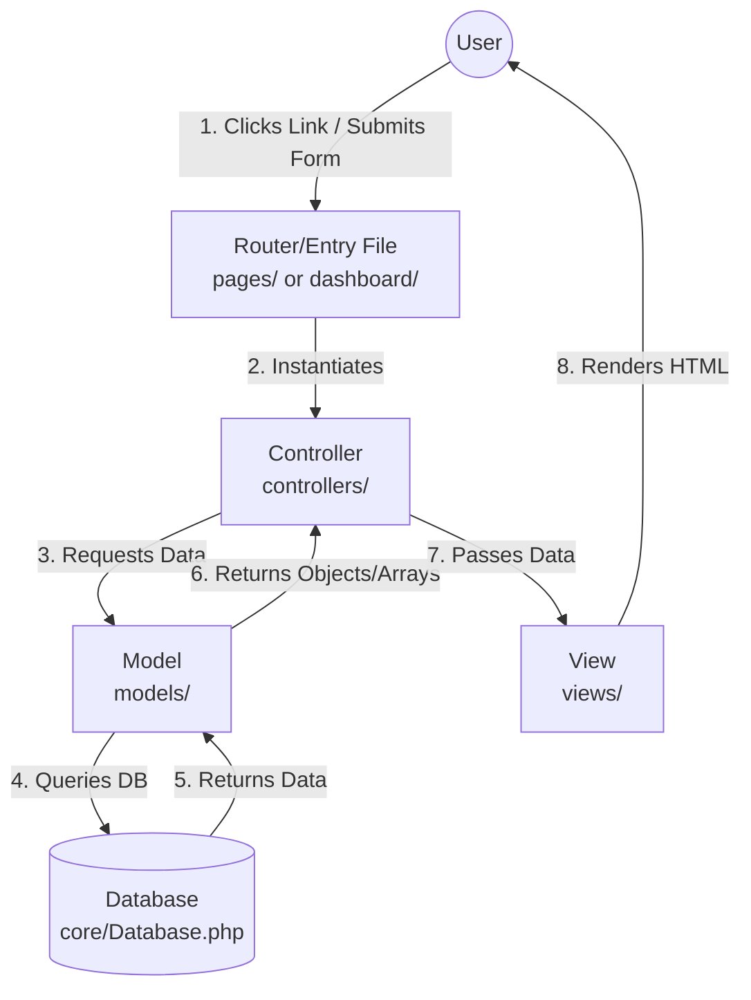
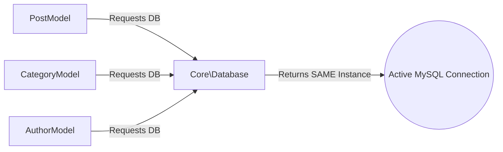

# System Architecture & Design Patterns

The news website has been completely refactored from "Procedural PHP" (where HTML and database logic are mixed in the same file) to a modern **Object-Oriented MVC Architecture**. 

Here is a breakdown of the specific design patterns used and how your folders connect.

---

## 1. MVC Pattern (Model-View-Controller)
This is the core architectural pattern of the application. It separates the application into three interconnected parts to separate internal representations of information from the ways information is presented to the user.

### How the Folders Work Together in MVC:
*   **`models/` (The Brain):** Contains classes like `Post.php`, `Category.php`, and `Author.php`. These classes are the **only** files allowed to talk to the database. They contain your SQL queries and return raw data.
*   **`views/` (The Face):** Contains pure HTML files mixed with minimal PHP (just `echo` and `foreach` loops). This folder is completely blind to the database. It only knows how to display the data it is handed.
*   **`controllers/` (The Traffic Cop):** Contains classes like `PostController.php`. When a user visits a page, the Controller wakes up, asks the **Model** for data, and then hands that data to the **View** to be displayed.

---

## 2. Singleton Pattern (Database Connection)
In the old code, every single file created a new connection to the database (`include 'db.php'`). If 10 people visited the site, you had 10 separate connections opening and closing.

*   **Location:** `core/Database.php`
*   **How it works:** The Singleton pattern ensures that a class has **only one instance** and provides a global point of access to it. When any Model needs to talk to the database, it asks the `Database` class. The class checks if a connection already exists. If it does, it shares the existing one. This saves massive amounts of server memory and prevents the `Access denied for user 'root'@'localhost'` error you were getting.

---

## 3. Autoloader Pattern (PSR-4 Standard)
Previously, you had to write `include '../models/Post.php'; include '../models/Category.php';` at the top of every file. If you moved a file, the entire site broke.

*   **Location:** `core/autoloader.php`
*   **How it works:** I implemented a dynamic class loader using PHP namespaces. When you type `new Controllers\PostController()`, the Autoloader detects that the `PostController` class is missing, calculates exactly where the file is located based on its namespace (`controllers/PostController.php`), and automatically requires it in the background.

---

## 4. The "Front Controller / Router" Concept
To prevent all of your existing website links from breaking, I kept your original files but turned them into **Routers**.

*   **Locations:** `pages/`, `dashboard/`, `functions/`
*   **How it works:** Files like `dashboard/admincategories.php` used to contain 100 lines of messy HTML and SQL. Now, they are just 3 lines long. They simply act as a doorway. When a user visits `dashboard/admincategories.php`, the file immediately passes control to `CategoryController->index()`, which handles the rest. This preserves all your original URLs while utilizing the clean MVC backend!
